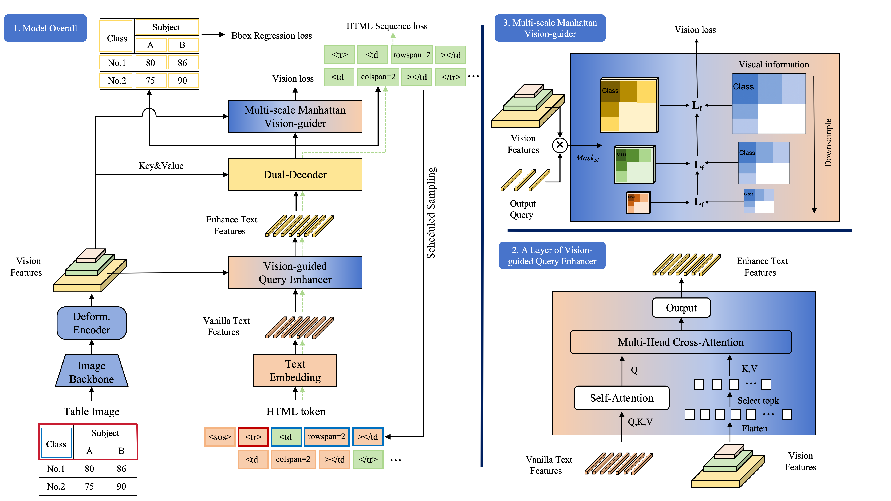

  <h1 align="left">G2LFormer</h1>





### Dependency

* [MMOCR-0.2.0](https://github.com/open-mmlab/mmocr/tree/v0.2.0)
* [MMDetection-2.11.0](https://github.com/open-mmlab/mmdetection/tree/v2.11.0)
* [mmcv-full-1.4.0](https://github.com/open-mmlab/mmcv/tree/v1.4.0)


<!-- GETTING STARTED -->

## Getting Started

### Installation


1. Install pytorch torchvision torchaudio cython mmpycocotools rapidfuzz numpy.
   
   ```sh
   conda create -n G2LFormer python=3.9
   conda activate G2LFormer
   pip install torch==1.10.0+cu111 torchvision==0.11.0+cu111 torchaudio==0.10.0 -f https://download.pytorch.org/whl/torch_stable.html
   pip3 install cython==0.29.33 -i http://mirrors.aliyun.com/pypi/simple/ --trusted-host mirrors.aliyun.com
   pip install mmpycocotools
   pip install rapidfuzz==2.15.1
   pip install numpy==1.23.5
   ```

2. Install mmdetection. click [here](https://github.com/open-mmlab/mmdetection/blob/v2.11.0/docs/get_started.md) for details.
   
   ```sh
   # We embed mmdetection-2.11.0 source code into this project.
   # You can cd and install it (recommend).
   cd ./mmdetection-2.11.0
   pip install -v -e .
   ```
   
3. Install mmocr. click [here](https://github.com/open-mmlab/mmocr/blob/main/docs/install.md) for details.

   ```sh
   # install mmocr
   cd {Path to TableMASTER_mmocr}
   pip install -v -e .
   ```

4. Install mmcv-full-1.4.0. click [here](https://github.com/open-mmlab/mmcv) for details.

   ```sh
   pip install mmcv-full=={mmcv_version} -f https://download.openmmlab.com/mmcv/dist/{cu_version}/{torch_version}/index.html
   
   # install mmcv-full-1.4.0 with torch version 1.10.0 cuda_version 11.1
   pip install mmcv-full==1.4.0 -f https://download.openmmlab.com/mmcv/dist/cu111/torch1.10.0/index.html
   ```
   
5. Install MultiScaleDeformableAttention

   ```sh
   cd {Path to Deformable/model/ops}
   sh make.sh
   ```


<!-- USAGE EXAMPLES -->

## Usage

### Train

 Train table structure recognition model, with **G2LFormer**.

   ```shell
   sh ./table_recognition/expr/table_recognition_dist_train.sh
   ```

### Inference

   ```shell
   python ./table_recognition/table_inference_chs_{name of dataset}.py
   ```

### Get TEDS score

1. Installation.

   ```shell
   pip install -r ./table_recognition/PubTabNet-master/src/requirements.txt
   ```


2. Calcutate TEDS score. Before run this script, modify pred file path and gt file path in [generate_teds_score.py](./table_recognition/PubTabNet-master/src/generate_teds_score.py)

   ```shell
   python ./table_recognition/PubTabNet-master/src/generate_teds_score.py
   ```


<!-- Pretrain Model -->

## Pretrained Model

The **G2LFormer** pretrained model. In the validation set, the TEDS-S accuracy is **98.61**.

[[BaiduYun Drive]](https://pan.baidu.com/s/1-36DU8hMT-EcjDVnI9hrgA?pwd=hzhz)


<!-- LICENSE -->

## License

This project is licensed under the MIT License. See LICENSE for more details.


<!-- Citations -->

## Citations

```latex
@article{G2LFormer,
  title={G2LFormer: Global-to-Local Query Enhancement for Robust Table Structure Recognition},
  author={Haosheng Cai and Yang Xue},
  booktitle={ACM MultiMedia},
  year={2025}
}

```

## Acknowledege

This project is borrowed from TableMaster.
